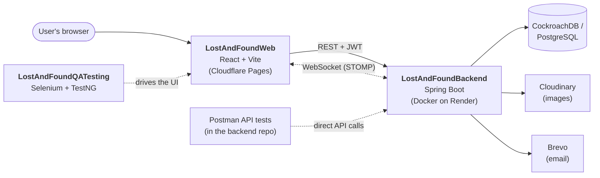

# 🧭 Lost & Found Nepal

A full-stack web app for reporting lost items, posting found items, and helping people get their belongings back, built around Nepal.

> **A personal project.** I built this on my own, to learn and to practise full-stack development, backend design, and automated QA end to end. It is not a commercial product and isn't affiliated with any organisation.

🌐 **Live site:** [lostandfoundnepal.pages.dev](https://lostandfoundnepal.pages.dev/)


---

## 📦 The three repositories

This project is split into three repos that work together:

| Repository | Role | Stack |
|---|---|---|
| [**LostAndFoundWeb**](https://github.com/maheshzrawal333/LostAndFoundWeb) | Frontend: the UI people actually use | React 19, TypeScript, Vite, Tailwind CSS |
| [**LostAndFoundBackend**](https://github.com/maheshzrawal333/LostAndFoundBackend) | REST + WebSocket API, auth, data, media and email | Java, Spring Boot, JPA/Hibernate, JWT, Postman API tests |
| [**LostAndFoundQATesting**](https://github.com/maheshzrawal333/LostAndFoundQATesting) | Automated end-to-end UI tests | Selenium, TestNG, Maven |

## 🏗️ How they fit together



- The **web app** talks to the **backend** over HTTPS (REST, secured with JWT) and keeps a WebSocket open for live updates.
- The **backend** owns all data and integrations: the database, image storage, and outgoing email.
- The **QA suite** behaves like a real user. It opens the web app in a browser and checks that the whole flow works across the frontend and backend.
- The **Postman tests** in the backend repo call the API directly, so API problems can be caught without a browser.

## ✨ Features

- 🔐 User accounts with JWT-based authentication
- 📝 Report a **lost** or **found** item
- 🙋 Submit a **claim** on a found item
- 🖼️ Photo uploads, compressed in the browser before upload and stored on Cloudinary
- ⚡ Real-time updates over WebSocket (STOMP / SockJS)
- 📧 Email notifications via Spring Mail (Brevo)
- ✅ Automated browser tests (Selenium) covering the main user flows
- 🧪 Postman API automation tests for the backend

## 🧰 Tech stack

**Frontend (`LostAndFoundWeb`)**
React 19 · TypeScript · Vite · Tailwind CSS · Axios · `@stomp/stompjs` + SockJS · `browser-image-compression` · ESLint

**Backend (`LostAndFoundBackend`)**
Java 21 · Spring Boot 4.1 (Web MVC, Data JPA/Hibernate, Security, Validation, WebSocket, Mail) · JJWT · PostgreSQL driver (CockroachDB in the cloud) · H2 (local/dev) · Cloudinary · Logback · Lombok · Maven · Docker · Postman (API tests)

**QA (`LostAndFoundQATesting`)**
Java · Selenium WebDriver 4.49 · TestNG 7.12 · Maven

## 🚀 Getting started locally

Run the backend first, then the frontend, then (optionally) the tests.

### 1. Backend

**Requirements:** JDK 21+, and Maven (or use the included wrapper).

```bash
git clone https://github.com/maheshzrawal333/LostAndFoundBackend.git
cd LostAndFoundBackend
./mvnw spring-boot:run        # Windows: mvnw.cmd spring-boot:run
```

You'll need to supply the following configuration (via `application.properties` or environment variables, whichever the project uses). **Never commit real secrets.**

| Setting | Purpose |
|---|---|
| Database URL / user / password | PostgreSQL or CockroachDB. H2 works for local development |
| JWT secret and expiry | Signing and validating auth tokens |
| Cloudinary credentials | Storing uploaded item photos |
| Mail / Brevo SMTP credentials | Sending email notifications |
| Allowed frontend origin (CORS) | Lets the web app call the API |

**Run with Docker:**

```bash
docker build -t lost-and-found-backend .
docker run -p 10000:10000 --env-file .env lost-and-found-backend
```

The image is a two-stage build (Maven → slim JRE) that exposes port `10000` and caps JVM memory so it fits on small free-tier hosts.

### 2. Frontend

**Requirements:** Node.js 20+ and npm.

```bash
git clone https://github.com/maheshzrawal333/LostAndFoundWeb.git
cd LostAndFoundWeb
npm install
npm run dev
```

Point the API client (`src/services/apiClient.ts`) and the WebSocket endpoint at your local backend URL.

Other scripts:

```bash
npm run build     # production build
npm run preview   # preview the production build
npm run lint      # ESLint
```

<details>
<summary>📁 Frontend project structure</summary>

```
lost-and-found-web/
├── src/
│   ├── assets/
│   ├── components/
│   │   ├── common/        # Button, Modal, Input
│   │   ├── items/         # ItemCard, ReportModal, ClaimModal
│   │   └── layout/        # Navbar
│   ├── context/           # AuthContext
│   ├── services/          # apiClient, itemService
│   ├── types/             # item.types
│   ├── App.tsx
│   ├── main.tsx
│   └── index.css
├── package.json
└── tsconfig.json
```
</details>

### 3. QA tests

**Requirements:** JDK 23 (as set in the project's `pom.xml`), Maven, and a browser such as Chrome. Selenium Manager downloads the matching driver automatically.

```bash
git clone https://github.com/maheshzrawal333/LostAndFoundQATesting.git
cd LostAndFoundQATesting
mvn test
```

Make sure the target app URL used by the tests points at the environment you want to test, either your local frontend or the live site.

## ☁️ Deployment

| Part | Where it runs |
|---|---|
| Frontend | Cloudflare Pages: [lostandfoundnepal.pages.dev](https://lostandfoundnepal.pages.dev/) |
| Backend | Docker container on Render |
| Database | CockroachDB |
| Images | Cloudinary |
| Email | Brevo |

> ⏳ On free-tier hosting, the backend may take a little while to wake up on the first request after a period of inactivity.

## 🗺️ Repo-to-repo cheat sheet

| I want to… | Go to |
|---|---|
| Change how the site looks or behaves | `LostAndFoundWeb` |
| Add or change an API, rule, or integration | `LostAndFoundBackend` |
| Check API behaviour without the UI | Postman tests in `LostAndFoundBackend` |
| Check that everything still works end to end | `LostAndFoundQATesting` |

## 📄 License & usage

This is a personal project and no open-source license has been applied yet. You're welcome to read the code and learn from it. If you'd like to reuse any part of it, please get in touch first.

## 👤 Author

Built by **[@maheshzrawal333](https://github.com/maheshzrawal333)**, as a personal learning project.

Feedback, bug reports, and ideas are welcome. Open an issue on the relevant repo.
